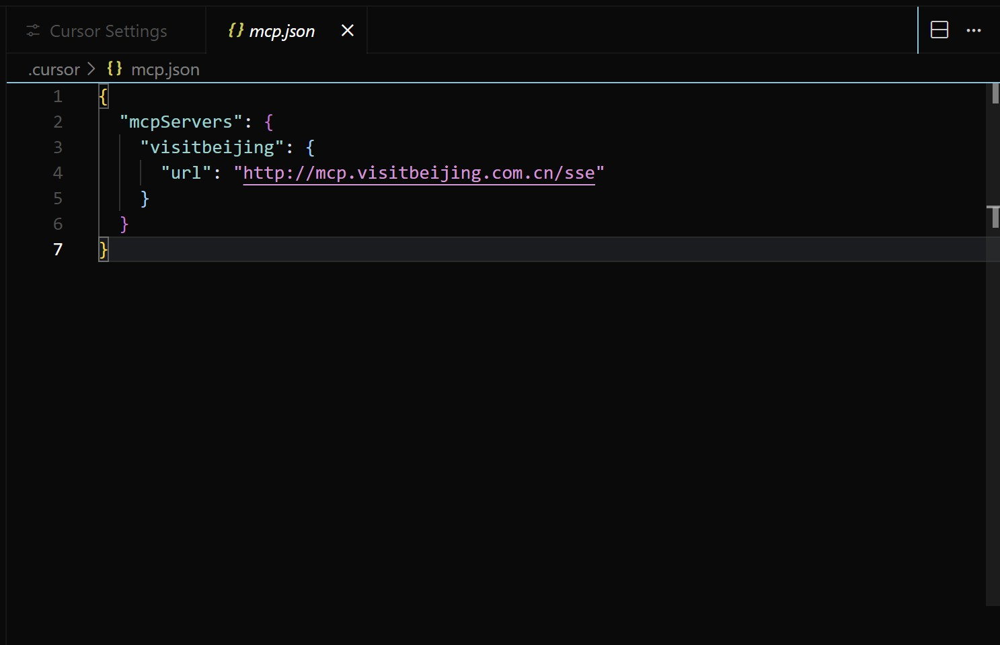

## visitbeijing-MCP Server
Provide real-time Beijing tourism information, real-time visitor flow queries for scenic spots, performance and exhibition updates, inbound travel guides, and other related information.


## Features
## Tools
- `get_attraction_comfort_information` Beijing Tourism Network's scenic spot passenger flow service provides real-time coverage of dynamic passenger flow data from 216 A-level scenic spots in the city, accurately presenting the current number of visitors and tourist density in the park, helping tourists scientifically plan their itinerary and staggered tours.
- `get_travel_information`The tourism information service of Beijing Tourism Network focuses on the latest dynamic information of scenic spots in Beijing and its suburbs, covering multi-dimensional travel information such as seasonal recommendations, unique gameplay, and themed travel routes.  
-`get_activity_news`The exhibition and performance service of Beijing Tourism Network provides the latest information on cultural activities such as art exhibitions, stage plays, concerts, etc. in Beijing, covering accurate event times, locations, highlights, and venue features.
- `inbound_tourism_guide`The Beijing Tourism Network's inbound travel guide service integrates policy information such as a 240 hour transit visa free policy, covering core services such as "buy and refund" for departure tax refunds, POS machine information for foreign cards, and multi scenario payments for digital RMB. It also provides multilingual services for international chain hotels, English menus for specialty restaurants, and tax-free shopping guides to help overseas tourists plan their trips conveniently.
## Installation
```
{
  "mcpServers": {
    "visitbeijing": {
      "url": "http://mcp.visitbeijing.com.cn/sse?ak=XXXXXXX"
    }
  }
}
```

## Contact Us
Please reach out to [lishuo@huaqniu.com][1] for our certification. We take security and privacy very seriously, and we are committed to protecting data.


  [1]: mailto:lishuo@huanqiu.com
